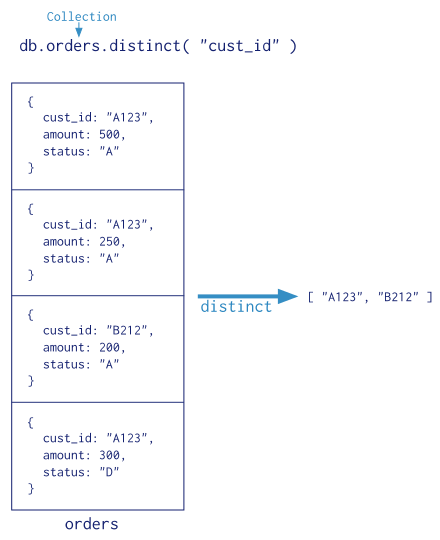

# 聚合
在本页面

*   [聚合管道 Aggregation Pipeline](#aggregation-pipeline)

*   [Map-Reduce](#map-reduce)

*   [单用途聚合操作 Single Purpose Aggregation Operations](#single-purpose-aggregation-operations)

*   [其他 Features 和行为 Additional Features and Behaviors](#additional-features-and-behaviors)

聚合操作处理数据记录和 return 计算结果。聚合操作将来自多个文档的值组合在一起，并且可以对分组数据执行各种操作以返回单个结果。 MongoDB 提供了三种执行聚合的方法：[聚合管道](#聚合管道)，[map-reduce function](#map-reduce)和[单一目的聚合方法](#单用途聚合操作)。

## 聚合管道

MongoDB 的[Aggregation framework](Aggregation/Aggregation-Pipeline.md)是以数据处理流水线的概念为蓝本的。文档进入 multi-stage 管道，将文档转换为聚合结果。

最基本的管道阶段提供过滤器，其操作类似于查询和文档转换，可以修改输出文档的形式。

其他管道操作提供了按特定字段或字段对文档进行分组和排序的工具，以及用于聚合数组内容(包括文档数组)的工具。此外，管道阶段可以使用[operators](Reference/Operators/Aggregation-Pipeline-Operators.md)执行任务，例如计算平均值或连接 string。

<iframe 
    height=450 
    width=800 
    src="../img/docs/Aggregation/agg-pipeline.mp4" 
    frameborder=0 
    allowfullscreen>
</iframe>

该管道使用 MongoDB 中的原生操作来提供高效的数据聚合，是 MongoDB 中数据聚合的首选方法。

聚合管道可以在[分片集合  sharded collection]()上运行。

聚合管道可以使用索引来改善其某些阶段的性能。此外，聚合管道具有内部优化阶段。有关详细信息，请参阅[管道操作和索引](Aggregation/Aggregation-Pipeline.md#管道操作员和索引)和[聚合管道优化](Aggregation/Aggregation-Pipeline/Aggregation-Pipeline-Optimization.md)。

## Map-Reduce

MongoDB 还提供[map-reduce](Aggregation/Map-Reduce.md)操作来执行聚合。通常，map-reduce 操作有两个阶段：一个 map 阶段，它处理每个文档并为每个输入文档发出一个或多个 objects，并减少组合 map 操作输出的阶段。可选地，map-reduce 可以具有最终化阶段以对结果进行最终修改。与其他聚合操作一样，map-reduce 可以指定查询条件以选择输入文档以及排序和限制结果。

Map-reduce 使用自定义 JavaScript 函数来执行 map 并减少操作，以及可选的 finalize 操作。虽然自定义 JavaScript 与聚合管道相比提供了极大的灵活性，但通常，map-reduce 的效率低于聚合管道并且更复杂。

Map-reduce 可以在[分片集合 sharded collection]()上运行。 Map-reduce 操作也可以输出到分片集合。有关详细信息，请参阅[聚合管道和分片集合](Aggregation/Aggregation-Pipeline/Aggregation-Pipeline-and-Sharded-Collections.md)和[Map-Reduce 和 Sharded Collections](Aggregation/Map-Reduce/Map-Reduce-and-Sharded-Collections.md)。

> **注意** 
> 从 MongoDB 2.4 开始，在 map-reduce 操作中无法访问某些mongoshell 函数和 properties。 MongoDB 2.4 还支持多个 JavaScript 操作以在同一 time 运行 run。在 MongoDB 2.4 之前，JavaScript code 在单个线程中执行，引发了 map-reduce 的并发问题。

## 单用途聚合操作

MongoDB 还提供  db.collection.estimatedDocumentCount(), [db.collection.count()](Reference/mongo-Shell-Methods/Collection-Methods/db-collection-count.md)和[db.collection.distinct()](Reference/mongo-Shell-Methods/Collection-Methods/db-collection-distinct.md)。

所有这些操作都聚合来自单个集合的文档。虽然这些操作提供了对 common 聚合过程的简单访问，但它们缺乏聚合管道和 map-reduce 的灵活性和功能。

## 其他 Features 和行为

有关聚合管道 map-reduce 和特殊 group 功能的 feature 比较，请参阅[聚合命令比较](Aggregation/Aggregation-Reference/Aggregation-Commands-Commparison.md)。

